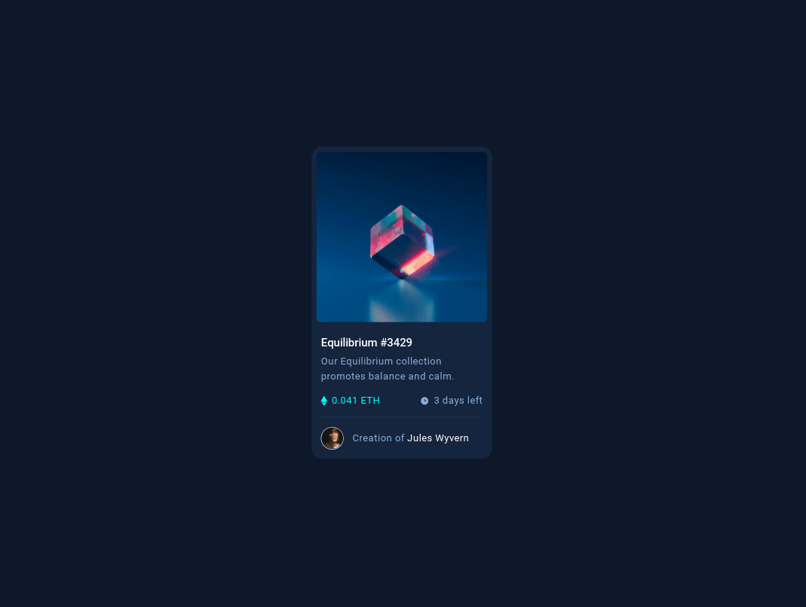
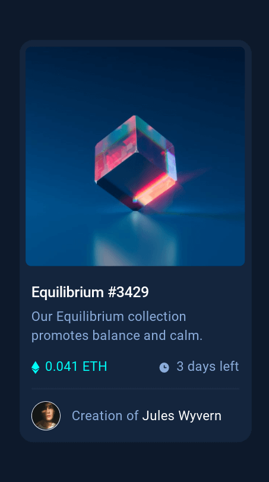
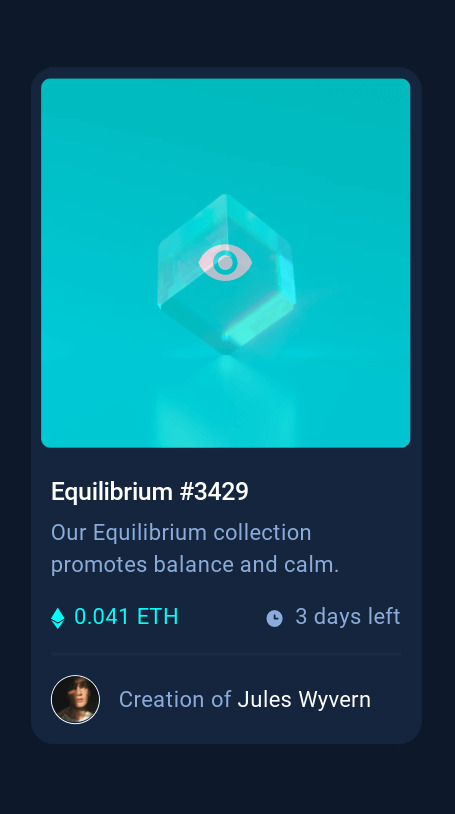

# Frontend Mentor - NFT preview card component solution

This is a solution to the [NFT preview card component challenge on Frontend Mentor](https://www.frontendmentor.io/challenges/nft-preview-card-component-SbdUL_w0U). Frontend Mentor challenges help you improve your coding skills by building realistic projects. 

## Table of contents

- [Overview](#overview)
  - [The challenge](#the-challenge)
  - [Screenshot](#screenshot)
  - [Links](#links)
- [My process](#my-process)
  - [Built with](#built-with)
  - [What I learned](#what-i-learned)
  - [Continued development](#continued-development)
  - [Useful resources](#useful-resources)

## Overview

### The challenge

Users should be able to:

- View the optimal layout depending on their device's screen size
- See hover states for interactive elements

### Screenshot

### Links

- Live Site URL: [Github Pages](https://jdegand.github.io/nft-preview-card-component)

## My process

### Built with

- Bootstrap
- CSS custom properties
- Flexbox
- Mobile-first workflow

### What I learned

Bootstrap doesn't have a class for "cursor:pointer".  

### Continued development

- Eliminate style.css and do everything inside index.html. 

### Useful resources

- [Croydon](https://www.croydon.gov.uk/design-and-content-guidelines/resources/pixel-rem-conversion-table) - Font size conversions
- [Stack Overflow](https://stackoverflow.com/questions/47269189/css-class-for-pointer-cursor) - Cursor Pointer Bootstrap
- [W3 Schools](https://www.w3schools.com/howto/howto_css_image_overlay_icon.asp) - CSS Image Overlay
- [Imagekit](https://imagekit.io/blog/css-image-overlay/#image-overlay-effects-using-css) - Image Overlay Effects